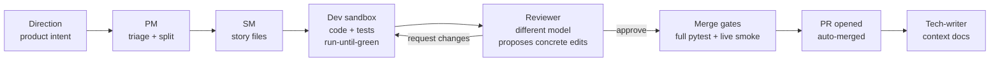

# 🏭 software-factory

**An autonomous software factory: an LLM persona pipeline that turns high-level product directions into reviewed, tested, merged pull requests — unattended, on cheap open-weight models.**


The thesis: **harness quality beats model size.** A well-instrumented pipeline of small, verifiable steps — each gated by real tests and a live runtime smoke check — ships production code on models ~10× cheaper than frontier subscriptions. In a head-to-head benchmark against one-shot Claude Code on the same backlog, the factory passed the merge gates on **7/7 tasks at $0.65/task** vs 5/7 at $8.19 ([full campaign report](bench/CAMPAIGN-2026-07-17.md)).

---

## How it works



- **Directions** are markdown work orders (`apps/<app>/directions/`) — filed by you, or by the factory's own scanner personas (hourly drift watchdog, bug hunter, weekly security audit, UX auditor).
- **Personas** are prompt-defined roles (`factory/personas/*.md`) executed either as tool-using sandboxes (OpenHands SDK) or single structured-JSON calls. Model routing per persona/difficulty lives in one file: `factory/routes.yaml`.
- **Nothing merges on green unit tests alone.** The `smoke-green` gate boots the PR's own code on an isolated port and drives the core user journey live before auto-merge.
- **Convergence machinery** keeps dev↔review loops short: the reviewer carries memory of its own previous findings, proposes concrete `FIND/REPLACE` edits, and a drift clamp stops goalpost-moving at cycle 3.

## The factory manages itself

A four-tier management pipeline (FMS) watches the factory's own telemetry:

| Tier | Role | Cadence |
|------|------|---------|
| L1 Watcher | summarize event streams, flag anomalies | every 60 s |
| L2 Summarizer | structured concern documents | on escalation |
| L3 Diagnostician | root-cause + unified-diff proposal | on escalation |
| L4 Apply | classify safe/forbidden, branch, test, PR | on proposal |

Blocked stories auto-recover (bounded), stale worktrees get pruned, and a halted factory refuses to burn spend until an operator runs `factory resume`.

## Quickstart

```bash
uv sync --all-extras          # dev extras included — bare `uv sync` omits pytest
uv run pytest -q              # 1000+ tests, ~30s
uv run factory --help
```

Wire an app (see `apps/sacrifice/config.yaml` for a complete example), then:

```bash
uv run factory pm-sync --app <app>   # triage directions into stories
uv run factory tick --app <app>      # one full pipeline pass
```

Continuous operation runs on two systemd user units: `factory-tick@<app>.timer` (pipeline heartbeat, 5 min) and `factory-manager.service` (FMS L1 daemon). Models and API keys are configured in `factory/routes.yaml` + `.env` (`.env.example` documents every key; Azure OpenAI, DeepSeek, and OpenRouter routing supported out of the box).

Day-to-day operator surface:

```bash
factory inbox                 # everything awaiting a human, across apps
factory status-sync --app X   # pinned [FACTORY] live-status GitHub issue
factory why <story-id>        # per-story event trail
factory resume                # clear an FMS halt (operator-only)
```

## Benchmarks

`bench/` contains a reproducible harness comparing the factory against one-shot Claude Code on real backlog tasks — same frozen base commit, same done-oracle (the app's own merge gates + a blind LLM-judge rubric).

| | Factory (open models) | Claude Code (one-shot) |
|---|---|---|
| Merge-gates pass rate | **7/7** | 5/7 |
| Mean cost per task | **$0.65** | $8.19 |
| Mean wall-clock | ~40 min | ~14 min |
| Diff-quality rubric | 0.84 | **0.92** |

Run it: `uv run python bench/bench.py --help` ([protocol + caveats](bench/README.md)).

## Repository map

```
factory/           the orchestrator
  chain/           state machine, handlers, gates, auto-merge, worktrees
  manager/         FMS tiers (watcher → summarizer → diagnostician → apply)
  personas/        prompt-defined roles (pm, sm, dev, reviewer, …)
  routes.yaml      per-persona model routing — the single model-choice seam
apps/<app>/        per-app config, directions (work orders), stories
bench/             factory-vs-Claude-Code benchmark harness + results
state/             runtime: sqlite db, event streams, worktrees (gitignored)
tests/             1086 tests
```

## Design principles

1. **Verification-first** — a feature is done when it runs live, not when tests pass. (The smoke gate exists because an early version shipped a green-but-unbootable app.)
2. **Decompose by context, not by pipeline stage** — the reviewer sees only the diff + gates + its own review history; the dev owns both code and tests.
3. **Everything loops at most 3–6 times** — retry caps, review-cycle caps, recovery caps. Nothing burns spend unbounded.
4. **The model is a config value** — swapping providers is a YAML edit; missing API keys degrade routes to a working fallback instead of crashing.
