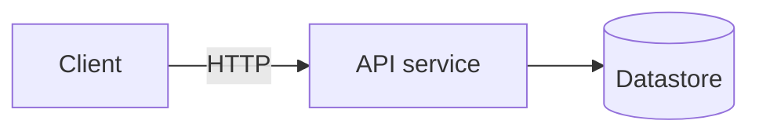
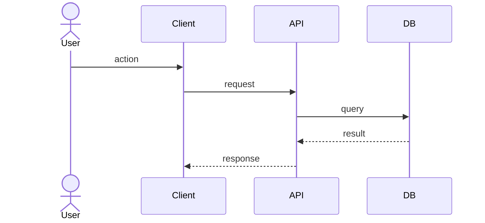

<!-- This file is CURRENT-STATE-ONLY. Do not preserve past states. -->
<!-- Rewrite diagrams whenever the system changes; do not append old versions. -->

# Architecture diagrams

## Component overview

## Request flow: <name the canonical user flow>

